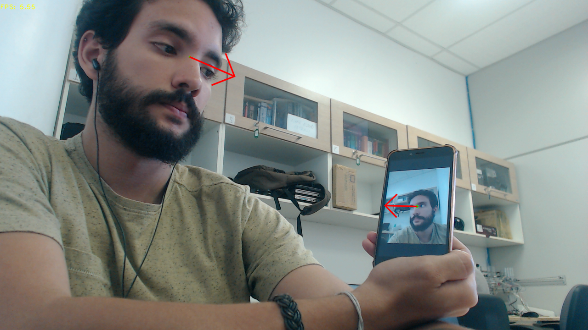

# Mobile FaceGaze
[](https://github.com/glefundes/Mobile-Face-Gaze/)
[](https://github.com/glefundes/Mobile-Face-Gaze/)

Pytorch implementarion of a modified version of the MPIIFaceGaze architecture presented in the paper 
[It's Written All Over Your Face: Full-Face Appearance-Based Gaze Estimation](http://openaccess.thecvf.com/content_cvpr_2017_workshops/w41/html/Bulling_Its_Written_All_CVPR_2017_paper.html) for
CNN-based gaze estimation in the wild.

<p align="left">
  
</p>

## Table of Contents
1. [ Introduction. ](#intro)
2. [ Implementation Details. ](#impl)
    1. [Quick Start. ](#quick)
3. [ Installation. ](#install)
4. [ Usage. ](#usage)
    1. [ Running the Demo. ](#demo)
    2. [ Training from scratch. ](#train)  
5. [ References. ](#references)
6. [ TODO. ](#todo)
<hr>

<a name="intro"></a>
### Introduction:
This is a lightweight version of the MPIIFaceGaze CNN architecture for gaze estimation in the wild. The original code and weights
were made available for the Caffe framework, so I decided to reimplement it in PyTorch. As a bonus, I made changes so that the model would be smaller without suffering from too much loss of performance. 

<a name="quick"></a>
#### Quick Start:
Check out the [Step-by-Step tutorial notebook](https://github.com/glefundes/Mobile-Face-Gaze/blob/master/step-by-step.ipynb) for a clear view of each step in the processing pipeline! :)

<a name="impl"></a>
### Implementation Details:
In reimplementing the architecture as proposed in the original paper I got models with a whopping **700MB+**!
This was just not feasible for me, so I set out to modify the architecture in hopes that I could make it lightweight
enough without huge impacts on performance.
Below is a table of the changes made in order to reduce the model to the final **17.7MB** achieved.

|           | Backbone     | Size of feat. vector | Input resolution | # of Params. |
|-----------|--------------|----------------------|------------------|--------------|
| Original  | AlexNet      | 4096                 | 448x448          | 196.60M      |
| This Repo | MobileNetV2* | 512                  | 112x112          | 4.39M        |

*[I also changed MobileNetV2's final convolution layer's output to 256](https://github.com/glefundes/mobile-facegaze/blob/bcbf6de7cffe62124897aa08768f00cc2755c039/models/gazenet.py#L23).

Quantitative evaluation by LOOCV on the MPIIFaceGaze dataset revealed no more than 1 degree increase in Mean Average Error when compared to my reimplementation of the original.
Qualitative evaluation on images in the wild and webcam tests show results to be satisfactory.

<a name="install"></a>
### Installation:
Code was tested on Python 3.5, but should work with later releases.

Clone the repository, then:
```
$ pip install -r requirements.txt
```
All project dependencies should be taken care of for you.
For GPU support please refer to [PyTorch's installation guide](https://pytorch.org/get-started/locally/)

<a name="usage"></a>
### Usage:

<a name="demo"></a>
#### Running the demo:
There is a packaged demo code that uses images from the webcam to detect faces and infer gaze angles.
Please note that the code is tested to run on CPU as well as GPU devices. If you are trying to run the code on GPU without success, please double check you environment for all correct CUDNN, CUDA and PyTorch packages.

The demo can be run out-of-the-box with:
```
$ python3 cam_demo.py
```
Faces are detected by a modified version of [TropComplique's implementation of MTCNN](https://github.com/TropComplique/mtcnn-pytorch)(Added GPU support and repackaged the detection function into the [FaceDetector class](https://github.com/glefundes/mobile-facegaze/blob/a4a26409f0137103dd80693708813d85b53c740b/mtcnn/detector.py#L8)).

Afterwards, facial regions are normalized for scale and rotation using the eye keypoints as reference for the slope. The normalization function was adapted from the imutils package.

The normalized faces are then passed through the gaze estimation network. The inferred gaze angles are drawn on screen with opencv helper functions.



On higher resolutions the FPS can drop quite a bit. The MTCNN is the obvious bottleneck here. If you wish to replace it with some other more powerful face detector, it really shouldn't be a problem. All you need to do is make sure the face normalization function is adapted to work with the new method's output format.

<a name="train"></a>
#### Training from scratch:

Weights pre-trained on a GTX Titan X are located in the `models/weights` folder. If for some reason you with to train the network yourself, here's what you need to do:
* Download and extract normalized data from the original MPIIFaceGaze dataset from the [original project page](https://www.mpi-inf.mpg.de/departments/computer-vision-and-machine-learning/research/gaze-based-human-computer-interaction/its-written-all-over-your-face-full-face-appearance-based-gaze-estimation/).
  
  The data is packaged as .mat files. Opening those up in Python can be quite a pain. The best solution for me was to extract the raw face images for each of the 15
  subjects on the dataset and save the ground truth labels as Pickle objects. In this repo is a very helpful script to do just that
  
  
  You can download and extract the data automatically by running the following commands:
  ```
  ~$ cd mpiifacegaze_dataset
  mpiifacegaze_dataset$ python3 download_and_extract.py
  ```
  Just be aware that the compressed dataset is 20GB+ in size, make sure you have at least 50GB free for the data.
  After the process is complete, you can delete the .zip and .mat files.

* Train on the provided training script

  You can train on the same hyperparameters I used by just running:
  ```
  ~$ python3 train.py
  ```
  If you want to change learning rates, batch size, etc. please refer to the training script's accepted arguments by running it with the `-h` flag.
  The provided script will train the model on all 15 subjects present in the dataset (see figure below). For simplicity's sake I did not include the LOOCV training routine.
  if you wish to validate your model for comparison, you must modify the script and data loader as to train a model for each set of 14 subjects while computing the error on the 15th.
  The MAE will be the mean of all 15 angle errors.

  

### References:
```
@inproceedings{zhang2017s,
  title={It's written all over your face: Full-face appearance-based gaze estimation},
  author={Zhang, Xucong and Sugano, Yusuke and Fritz, Mario and Bulling, Andreas},
  booktitle={Proceedings of the IEEE Conference on Computer Vision and Pattern Recognition Workshops},
  pages={51--60},
  year={2017}
}
```

<a name="todo"></a>
#### TODO:
* ~~Notebook guide for step-by-step execution~~
* Better adaptation of MTCNN for modern pytorch (the original was from 0.2!)
* More pictures and gifs!
* Smooth angles post-processing by tracking and filtering 
